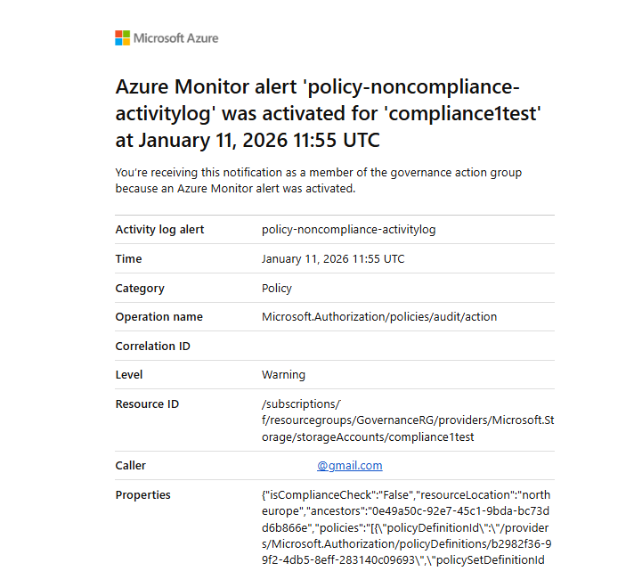
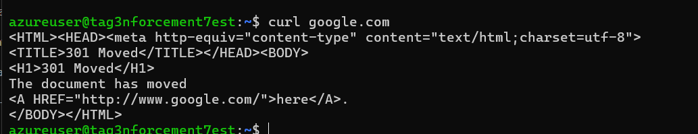

# Azure Learning Path 

My hands-on learning journey through Microsoft Azure, focusing on practical labs and real-world scenarios. Built as a portfolio project to demonstrate cloud administration and governance skills.

**Learning approach:** Hands-on practice first, theory second. All labs completed using Azure Free Tier.

---

## 📚 Learning Goals

### Current Focus
- **AZ-900 (Azure Fundamentals)** - Core cloud concepts and Azure services
- **AZ-104 (Azure Administrator)** - Practical administration, governance, and monitoring

### Planned
- **DP-900 (Data Fundamentals)** - Azure data services for analytics

---

## What This Repository Demonstrates

### AZ-900 Skills (Fundamentals)
✅ Virtual Machines, Resource Groups, and resource management  
✅ Core Azure services (Compute, Storage, Networking, Databases)  
✅ Cost management and budget monitoring  
✅ Cloud database deployment (PostgreSQL)  

### AZ-104 Skills (Administrator)
✅ **Networking:** Hub & Spoke architecture, VNet peering, NSGs, Firewall  
✅ **Governance:** Azure Policy assignments, Policy Initiatives, compliance monitoring  
✅ **RBAC:** Role assignments, permission boundaries, custom roles  
✅ **Monitoring:** Azure Monitor alerts, compliance alerts, Action Groups  

### SC-900 Overlap (Security)
✅ Least privilege principle (RBAC)  
✅ Policy-based compliance enforcement  
✅ Access control validation and testing  

---

## 🧪 Labs & Projects

### Lab 1: First Azure Virtual Machine

**Goal:** Get comfortable with Azure Portal, VMs, and SSH connectivity

**What I Built:**
- Linux VM (Ubuntu 22.04)
- Network Security Group (NSG) with SSH access
- Successfully connected via SSH from local machine
- Explored Azure Cloud Shell

**Technologies:** Azure VMs, NSG, SSH, Azure Portal  

**Key Learning:**
- Resource naming conventions matter for organization
- NSG rules control inbound/outbound traffic
- Free tier limitations (VM sizes, regions)
- Stop vs Deallocate (important for cost!)

---

### Lab 2: Hub & Spoke Networking + Azure Firewall (AZ-104)

**Goal:** Implement enterprise-style network architecture with centralized security


**What I Built:**

#### Hub VNet (vnet-hub-dev-01)
- **Purpose:** Centralized shared services
- **Components:**
  - Azure Firewall (fw-test)
  - Firewall Policy (fwpol-hub-dev-01)
  - Public IP for Firewall management
  - Route table for traffic routing

#### Spoke VNets
- **vnet-spoke-app-01:** Application workload environment
- **vnet-spoke-data-01:** Data/database workload environment

#### VNet Peering (Bidirectional)
- Hub ↔ Spoke-App connectivity
- Hub ↔ Spoke-Data connectivity
- Private, low-latency communication without public internet

#### Supporting Resources
- Virtual Machine (FW-VM-TEST) for testing
- SSH Key (fw-vm-test_key)
- Public IP (fw-vm-test-ip)
- Network Interface + Disk storage
- Network Security Group (fw-vm-test-nsg)
- Route table (rt-spoke-egress) for egress traffic control

**Why Hub & Spoke?**
- **Centralized Security:** Firewall in Hub inspects all traffic
- **Isolation:** Each Spoke is isolated from others (unless explicitly allowed)
- **Scalability:** Easy to add new Spokes without touching existing ones
- **Cost Efficiency:** Shared services in Hub (VPN, Firewall, Bastion)

**Why VNet Peering?**
- Private connectivity (no public internet)
- Low latency (Azure backbone network)
- No additional cost for same-region peering
- Enables transitive routing through Hub

**Technologies:** Azure VNets, VNet Peering, Azure Firewall, Route Tables, NSGs  

**Key Learning:**
- Hub-Spoke is the foundation for Azure enterprise networking
- VNet CIDR ranges must not overlap (careful planning required!)
- Route tables control traffic flow between VNets
- Azure Firewall provides stateful network and application-level filtering

---

### Lab 3: Azure Policy & Governance (AZ-104)

**Goal:** Enforce organizational standards using Azure Policy


**Policies Implemented:**

#### 1. Location Restriction Policy


- **Policy Name:** "Allowed locations"
- **Effect:** Deny
- **Allowed regions:** Europe only (North Europe, West Europe)
- **Purpose:** Ensure data residency compliance (GDPR)

**Test Result:** ✅ **BLOCKED**
```
InvalidTemplateDeployment
The template deployment failed because of policy violation.
Deployment date: December 25, 2025, 10:07 GMT+01:00
User: [email]@gmail.com
```

**Real-world scenario:** Organization must keep data in EU for regulatory compliance.

---

#### 2. Tag Enforcement Policies


**Created 3 tag enforcement policies:**

| Tag Name | Purpose | Effect |
|----------|---------|--------|
| **Environment** | dev/test/prod separation | Deny |
| **CostCenter** | Chargeback to departments | Deny |
| **Owner** | Accountability & contact | Deny |

**Test Result:** ✅ Resource creation **BLOCKED** when tags missing

Error message shows:
- Code: "RequestDisallowedByPolicy"
Multiple tag policies were violated:
- Policy: Require 'Environment' tag and its value
- Policy: Require 'CostCenter' tag and its value  
- Policy: Require 'Owner' tag and its value

**Real-world value:**
- **CostCenter:** Enables billing by department (e.g., "Marketing", "Engineering", "Sales")
- **Environment:** Different policies per environment (e.g., dev = relaxed, prod = strict)
- **Owner:** Enables accountability and knowing who to contact about resources

**Key insight:** Tag policies can **Audit** (just flag) or **Deny** (block creation). I used Deny to enforce compliance from day one.

---

#### 3. Storage Account Public Access Audit



- **Policy:** "Audit Storage accounts with public access enabled"
- **Effect:** Audit (detects risky configurations but doesn't block)
- **Purpose:** Security visibility - flag potentially insecure storage accounts

**Azure Monitor Alert Configured:**
- **Alert name:** policy-noncompliance-activitylog
- **Triggered:** January 11, 2026 at 11:55 UTC
- **Category:** Policy
- **Level:** Warning
- **Resource ID:** Storage account "compliance1test"
- **Alert sent to:** [email]@gmail.com

**Alert details:**
```json
{
  "isComplianceCheck": "false",
  "resourceLocation": "north europe",
  "policies": [{
    "policyDefinitionId": "/providers/Microsoft.Authorization/policyDefinitions/b2982f36-99f2-4db5-8eff-283140c09693",
    "policySetDefinitionId": "..."
  }]
}
```

**Real-world scenario:**  
Security team wants visibility into risky configurations (public storage) without blocking developers during prototyping phase. They get email alerts when non-compliant resources are created.

---

#### 4. Policy Initiative (ASC Default)

**What is a Policy Initiative?**  
A Policy Initiative (also called Policy Set Definition) groups multiple related policies into a single assignment.

**Initiative Created:**
- **Name:** ASC Default (Azure Security Center Default)
- **Type:** Initiative
- **Scope:** Azure subscription 1
- **Contains:** Multiple policies for location, tags, storage security

**Why use Initiatives?**
- Assign 1 initiative instead of 50 individual policies
- Logical grouping (Security policies, Cost policies, Compliance policies)
- Easier management at scale
- Industry best practice for enterprise governance

**Technologies:** Azure Policy, Policy Initiatives, Compliance Dashboard, Azure Monitor, Action Groups  

**Key Learning:**
- **Policy effects hierarchy:** Deny (blocks) > Modify (auto-fixes) > Audit (flags only)
- **Tag policies** enable cost allocation (chargeback/showback to departments)
- **Initiatives** are essential for managing governance at scale
- **Compliance monitoring** is ongoing - alerts provide proactive governance

---

### Lab 4: RBAC - Role Assignments & Permission Testing (AZ-104 / SC-900)

**Goal:** Understand Azure's permission model and implement least privilege access


**Current Role Assignments:**

#### Owner Role (2 assignments)
- **User:** Teodora Pešić 
- **Type:** User
- **Scope:** Resource level
- **Permissions:** Full control including ability to assign roles to others

#### Custom Role: Project-Reader-With-Logs (1 assignment)
- **User:** Teodora Pešić
- **Type:** User
- **Scope:** Resource level
- **Purpose:** Auditor/Observer role
- **Permissions:**
  - Read access to all resources
  - Query access to Log Analytics
  - **Cannot** modify or delete anything

**Why custom role?**  
Built-in "Reader" role doesn't include Log Analytics query permissions. Custom role adds this specific permission while maintaining read-only access.

---


**RBAC Permission Testing:**

Tested **Contributor** role at Resource Group scope:

| Action | Result | Explanation |
|--------|--------|-------------|
| Create VM | ✅ Success | Contributor can create resources |
| Delete VM | ✅ Success | Contributor can delete resources |
| View subscription budgets | ❌ **Access Denied** | Budget requires Cost Management Reader role |
| Assign RBAC roles | ❌ **Disabled/Denied** | Only Owner can manage access |

**Screenshot shows:**
- **Current role assignments (1):** Contributor
- **Scope:** "This resource"
- **Group assignment:** --
- **Condition:** None

**Key Finding:**  
Contributor = "Grants full access to manage all resources" **BUT** cannot manage access control (role assignments).

---

#### Custom Role Design: Contributor-No-Delete

Created custom role to prevent accidental deletion:
```json
{
  "Name": "Contributor-No-Delete",
  "Description": "Can create and manage resources but cannot delete them",
  "Actions": [
    "*/read",
    "*/write"
  ],
  "NotActions": [
    "*/delete"
  ],
  "AssignableScopes": [
    "/subscriptions/[subscription-id]"
  ]
}
```

**Use Case:**
- Junior team members can deploy and configure resources
- Prevents accidental deletion in shared environments
- Demonstrates least privilege principle

**Technologies:** Azure RBAC, Custom Roles, Access Control (IAM), Permission Testing  

**Key Learning:**
- **Owner vs Contributor:** Only difference is access management capability
- **Subscription-level vs Resource Group-level:** Permissions inherit down the hierarchy
- **Custom roles** fill gaps when built-in roles don't fit exact needs
- **Test permissions with real attempts** - don't just assume based on role description!
- **Principle of least privilege:** Give users the minimum permissions needed to do their job

---

### Lab 5: Cost Management & Budget Alerts (AZ-900)

**Goal:** Practice cost awareness and implement budget monitoring


**Budget Configuration:**

- **Budget Name:** budget-azure-15d
- **Scope:** Teodora Pešić (Billing account)
- **Amount:** **$190.00 USD** per month
- **Period:** Resets monthly
- **Creation date:** December 1, 2025
- **Expiration date:** November 30, 2027

**Budget Alerts Configured:**

| Alert Type | Threshold | Amount | Action Group | Email Recipient |
|------------|-----------|--------|--------------|-----------------|
| Actual cost | 50% | $95 | None | [email]@gmail.com |
| Actual cost | 80% | $152 | None | [email]@gmail.com |
| Actual cost | 95% | $181 | None | [email]@gmail.com |

**Why these thresholds?**
- **50%:** Early warning - still time to optimize
- **80%:** Serious attention needed - review all resources
- **95%:** Critical - stop creating resources, start cleanup

**Language preference:** Default (English)

---

**Cost-Conscious Decisions Made:**

✅ **VM Strategy:**
- Used B-series VMs (burstable, cheaper than D-series)
- **Stopped VMs** when not in use (not just "turned off" - important!)
  - Stopped = Pay only for storage (~$1-2/month)
  - Running = Pay for compute + storage (~$50-80/month)

✅ **Storage:**
- Cleaned up orphaned disks (disks from deleted VMs still cost money!)
- Used Standard HDD instead of Premium SSD where performance wasn't critical

✅ **Networking:**
- Avoided unnecessary Public IPs (each costs ~$3/month)
- Used same-region VNet peering (free vs cross-region which costs)

✅ **Monitoring:**
- Avoided excessive Log Analytics ingestion (charged per GB)
- Used basic alerts without complex log queries

✅ **Cleanup Discipline:**
- Deleted test resources immediately after labs
- Set calendar reminders to check for forgotten resources

**Estimated Cost Breakdown:**
- VMs (if running 24/7): $50-80/month
- VMs (if stopped when not in use): $1-2/month
- Storage accounts: $1-5/month
- Public IPs: $3/month per IP
- VNet peering (same region): Free
- Azure Firewall: ~$1/hour (~$730/month - expensive!)

**Technologies:** Azure Cost Management, Budgets, Budget Alerts  

**Key Learning:**
- **Stop vs Deallocate:** "Stop" from portal = deallocate (good!). Just closing VM window = still running (bad!)
- **Orphaned resources:** Deleting VM doesn't delete disk, IP, NSG
- **Free tier limits:** 750 hours/month B1s VM, 5GB storage, limited services
- **Budget alerts are critical** - prevent bill shock
- **Plan cleanup before creating resources** - easier to prevent than fix later

---

### Lab 6: Azure Database for PostgreSQL (AZ-900)

**Goal:** Deploy and connect to a cloud-managed database


**What I Built:**

#### Azure Database for PostgreSQL Server
- **Server name:** [my-server].postgres.database.azure.com
- **Database:** postgres
- **User:** [db-username]
- **Server version:** PostgreSQL 17.7
- **Port:** 5432 (default)
- **SSL/TLS:** Required (TLSv1.3, cipher: TLS_AES_256_GCM_SHA384)

#### Connection Details
- **Client:** psql 16.11 (Ubuntu 16.11-0ubuntu0.24.04.1)
- **Connection from:** Local machine (IP whitelisted in Azure Firewall)
- **Protocol:** SSL connection with compression off

**Connection Command:**
```bash
psql "host=[my-server].postgres.database.azure.com user=[db-username] dbname=postgres sslmode=require"
```

---

**SQL Operations Performed:**

#### 1. Database Connection Validation
```sql
postgres=> \conninfo
```
**Output:**
```
You are connected to database "postgres" as user "[db-username]" 
on host "[my-server].postgres.database.azure.com" (address "my-IP") 
at port "5432".
SSL connection (protocol: TLSv1.3, cipher: TLS_AES_256_GCM_SHA384, compression: off)
```

#### 2. Create Table
```sql
CREATE TABLE test_table (
  id INT PRIMARY KEY,
  name TEXT
);
```
**Result:** `CREATE TABLE`

#### 3. Insert Data
```sql
INSERT INTO test_table VALUES (1, 'hello');
```
**Result:** `INSERT 0 1`

#### 4. Query Data
```sql
SELECT * FROM test_table;
```
**Result:**
```
 id | name  
----+-------
  1 | hello
(1 row)
```

---

**Version Compatibility Warning:**
```
WARNING: psql major version 16, server major version 17.
         Some psql features might not work.
```

**Not a problem for basic operations**, but in production you'd want matching versions.

**Technologies:** Azure Database for PostgreSQL, psql CLI, SSL/TLS encryption  

**Key Learning:**
- **Managed database benefits:**
  - Automatic backups
  - Automatic patching
  - High availability options
  - No server management overhead
- **SSL is mandatory** on Azure databases (secure by default)
- **Firewall rules required** - had to add my IP address in Azure Portal
- **Connection strings** are different from local PostgreSQL (include SSL mode)
- **Cloud databases are accessible from anywhere** (with proper firewall rules)

---

### Lab 7: Network Security Group Validation (AZ-104)

**Goal:** Validate VM network connectivity and NSG rule configuration



**Test Performed:**

Connected to Azure VM via SSH and tested outbound internet connectivity:
```bash
azureuser@tag3nforcement7est:~$ curl google.com
```

**HTTP Response Received:**
```html
<HTML><HEAD><meta http-equiv="content-type" content="text/html;charset=utf-8">
<TITLE>301 Moved</TITLE></HEAD><BODY>
<H1>301 Moved</H1>
The document has moved
<A HREF="http://www.google.com/">here</A>.
</BODY></HTML>
```

**What This Proves:**
- ✅ VM has **outbound internet access**
- ✅ NSG allows outbound traffic on port 80/443
- ✅ **DNS resolution** is working (curl resolved "google.com" to IP)
- ✅ **Default outbound rule** is functioning
- ✅ **Network routing** configured correctly

**NSG Rules Validated:**

**Inbound Rules:**
- **SSH (port 22):** Allowed from my specific IP address only
- **HTTP/HTTPS:** Blocked (no web server exposed)

**Outbound Rules:**
- **Internet access:** Allowed (default Azure outbound rule)
- **Priority:** Lower number = higher priority

**Security Best Practices Demonstrated:**
- ✅ **Inbound SSH restricted by source IP** (not open to 0.0.0.0/0)
- ✅ **Outbound internet allowed** (VMs need to download updates, packages)
- ✅ **Minimal inbound rules** (only what's needed)

**Technologies:** Azure NSG, curl, Linux networking, SSH  

**Key Learning:**
- **NSGs are stateful firewalls** (allow inbound SSH = auto-allow return traffic)
- **Default outbound rule** allows internet access (can be restricted if needed)
- **Always test connectivity** after NSG changes (don't assume!)
- **Source IP restrictions** are critical for SSH (prevent brute force attacks)
- **curl is a quick connectivity test** tool (also: ping, wget, telnet)

---

## Lab Data & Exports

Some labs generated data exports for further analysis:

### Tag Enforcement Results
**File:** `data/tag-enforcement-results.csv`

Contains policy compliance data showing which resources are missing required tags.  
Useful for generating compliance reports and identifying non-compliant resources at scale.

### Azure Monitor Alert Log
**File:** `data/azure-monitor-alerts-log.csv`

Historical log of Azure Monitor alerts triggered during governance testing.  
Demonstrates alert workflow and how to export alert data for analysis.

**Use cases for CSV exports:**
- Compliance reporting for audits
- Trend analysis (are we getting more or less compliant over time?)
- Integration with BI tools (Power BI, Excel dashboards)

---

## Cost Management Strategy

**Budget:** Free Tier + $200 credit (Azure for Students / Free Account)

**Monthly budget set:** $190 (leaving $10 buffer)

**Cost-Conscious Decisions:**
- Used B-series VMs (burstable, cost-effective)
- **Stopped VMs immediately** after labs (not just paused!)
- Avoided Log Analytics heavy ingestion (can get expensive)
- Cleaned up orphaned resources (disks, IPs, NICs)
- Prioritized same-region resources (cross-region = data transfer costs)

**Budget Alerts:**
- 50% threshold: Early warning
- 80% threshold: Review all resources
- 95% threshold: Emergency cleanup mode

**Cleanup Checklist:**

To avoid unexpected costs, delete in this order:

1. ✅ **Virtual Machines** (most expensive - compute charges)
2. ✅ **Azure Firewall** (very expensive - ~$1/hour)
3. ✅ **Public IP addresses** (small but unnecessary cost)
4. ✅ **Disks** (orphaned disks from deleted VMs)
5. ✅ **Log Analytics Workspace** (if created with data ingestion)
6. ✅ **Storage Accounts** (if not needed)
7. ✅ **Network resources** (VNets, peerings - usually free but clean for organization)
8. ✅ **Policy Assignments** (no cost, but cleanup for organization)

**Pro tip:** Use Azure Resource Visualizer to see all resources in a Resource Group at a glance before deleting.

---

## 📖 Learning Resources

**Official Microsoft Learn:**
- [AZ-900 Learning Path](https://learn.microsoft.com/en-us/certifications/azure-fundamentals/)
- [AZ-104 Learning Path](https://learn.microsoft.com/en-us/certifications/azure-administrator/)
- [Microsoft Learn Sandbox](https://learn.microsoft.com/) - Free temporary Azure subscriptions for hands-on practice

**YouTube Channels:**
- **John Savill's Technical Training** (highly recommended! Deep technical dives)
- **A Cloud Guru** (structured courses)
- **Adam Marczak - Azure for Everyone** (beginner-friendly)

**Hands-On Practice:**
- **Azure Free Tier:** 12 months free services + $200 credit (first 30 days)
- **Azure for Students:** $100/year credit (no credit card required)

**Community:**
- [Microsoft Tech Community](https://techcommunity.microsoft.com/t5/azure/ct-p/Azure)
- [Reddit r/AZURE](https://reddit.com/r/AZURE)

---

## 🎯 Next Steps

### Current Learning Goals
- [ ] **AZ-900 certification** (completing practice labs)
- [ ] **DP-900 (Data Fundamentals)** - Azure data services for analytics
- [ ] **Power BI + Azure SQL integration** - end-to-end data workflow
      
**Future focus areas:**
- Azure Data Factory (ETL pipelines)
- Azure Synapse Analytics (data warehouse)
- Azure Data Lake (big data storage)

---

## Related Projects

- **[Sales Management Desktop App](https://github.com/teodorapesicar-legend/sales-app.git)**  
  .NET 10 WPF application with Azure SQL Database, Entity Framework Core, and role-based authentication

---

## Why This Repository Exists

This repository documents my learning journey from **pharmacy technician to cloud/data professional**.

**My learning philosophy:**  
I learn best by **doing** - building real infrastructure, breaking things, fixing them, and documenting what works (and what doesn't). Theory is important, but hands-on experience is what makes concepts stick.

**What this repo demonstrates:**
- ✅ **Self-directed learning ability** - no formal training, just documentation and practice
- ✅ **Practical cloud administration skills** - not just theory, but real configurations
- ✅ **Cost awareness** - important skill for production environments (every resource costs money)
- ✅ **Documentation skills** - clear explanations, screenshots, and lessons learned
- ✅ **Problem-solving** - troubleshooting connectivity, policy violations, permission issues
- ✅ **Attention to detail** - proper naming conventions, security best practices, cleanup discipline

**For recruiters/interviewers:**

This is **real hands-on experience**, not just tutorials or courses. Every screenshot shows actual resources I created, every error message is one I encountered and solved, every lesson learned came from trial and error.

I'm particularly interested in how Azure skills apply to **data analysis workflows** - managing databases, controlling data access (RBAC), ensuring data governance (policies), and understanding cloud costs.

---

**Last Updated:** February 2025  

---

## 📸 Screenshots Directory

All lab screenshots are organized in the `/screenshots` folder:
```
screenshots/
├── 01-hub-spoke-architecture.png       ✅
├── 02-policy-assignments.png           ✅
├── 03-location-policy-violation.png    ✅
├── 04-tag-policy-violation.png         ✅
├── 05-policy-noncompliance-alert.png   ✅
├── 06-rbac-role-assignments.png        ✅
├── 07-rbac-my-access.png               ✅
├── 08-cost-budget-alerts.png           ✅
├── 09-sql-database-connection.png      ✅
└── 10-vm-network-connectivity-test.png ✅
```

---

**⭐ If you find this learning journey useful, feel free to star this repo!**
